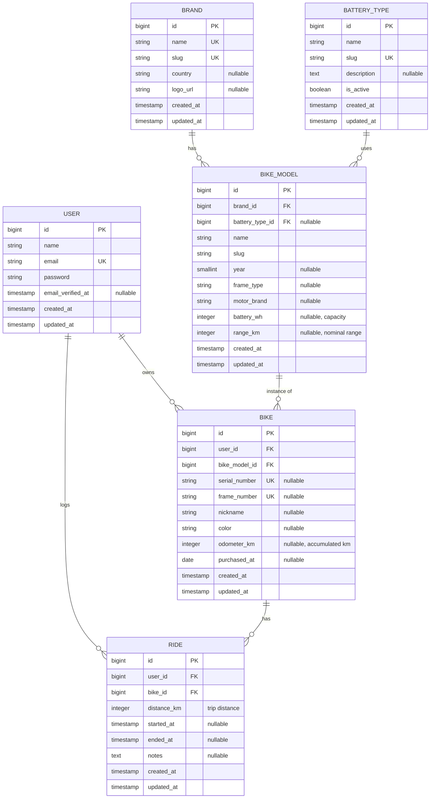

# ER Diagram — Bifix API

Data model for the Bifix REST API (e-bike maintenance platform).

## Full diagram

## Relationships

| Relationship | Cardinality | Description |
|--------------|-------------|-------------|
| User → Bike | 1:N | A user owns many bikes |
| User → Ride | 1:N | A user logs many rides |
| Brand → BikeModel | 1:N | A brand has many models |
| BatteryType → BikeModel | 1:N | A battery type applies to many models |
| BikeModel → Bike | 1:N | A model can have many bike instances |
| Bike → Ride | 1:N | A bike accumulates many rides |

## Design notes

### Catalog vs instance

- **Brand**, **BatteryType**, and **BikeModel** are master/reference data (seed/admin).
- **Bike** and **Ride** are user-owned data.

### Odometer and rides

- `Bike.odometer_km` stores the **accumulated mileage** of the bike.
- Each **Ride** records a single trip (`distance_km`).
- Creating, updating, or deleting a ride **syncs** `odometer_km` automatically.

### Battery types

Extensible catalog (`battery_types`) to support lead, lithium, and future chemistries without schema changes.

### Laravel conventions

| Table | Eloquent model |
|-------|------------------|
| `bike_models` | `BikeModel` |
| `rides` | `Ride` |

## Related endpoints

| Resource | Prefix |
|----------|--------|
| Auth | `/api/v1/auth/*` |
| Catalog | `/api/v1/brands`, `/bike-models`, `/battery-types` |
| Bikes | `/api/v1/bikes` |
| Rides | `/api/v1/bikes/{bike}/rides` |
